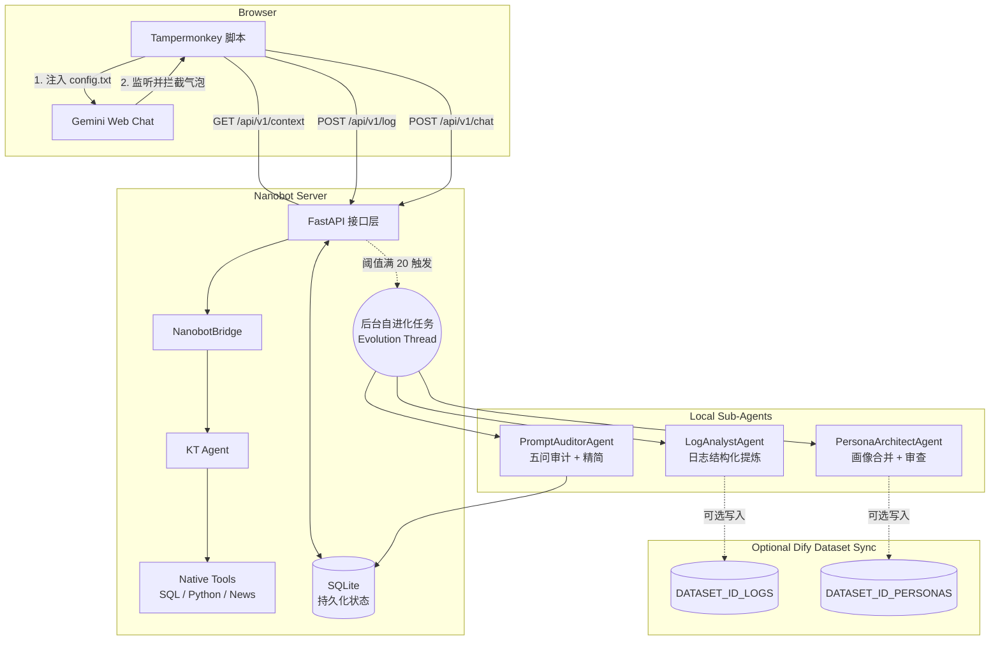

# Nanobot Server (v4 KT + new-api Gateway)

Nanobot Server 是一个独立的自进化 Python 微服务网关。它与 Dify 分离，通过 Tampermonkey 脚本对 Gemini Web 网页端进行浏览器端“无痛注入”以实现持久化记忆和系统角色护栏。

## 架构（当前实现）



说明：
- 聊天主链路已迁移为 KT Bridge + KT Agent，不再由 Dify 01 直接承载对话编排。
- 进化链路在本地 Python 子代理内闭环执行（日志提炼 -> 画像更新 -> Prompt 审计 -> 回写数据库）。
- 若配置了 `DATASET_ID_LOGS` / `DATASET_ID_PERSONAS`，会额外同步摘要到 Dify 知识库（可选）。

## 本地开发启动

```bash
# 安装依赖
pip install -r requirements.txt

# 运行服务器 (热重载模式)
uvicorn server:app --reload --port 8000
```

## new-api 配置

```env
LLM_PROVIDER=new-api
NEW_API_BASE_URL=https://api.new-api.com/v1
NEW_API_KEY=sk-xxx
NEW_API_TIMEOUT=180

# 模型分级
LLM_MODEL_SMART=gpt-4o
LLM_MODEL_FAST=gpt-4o-mini
LLM_MODEL_REASONING=o1-mini
```

## Docker 部署

```bash
# 复制并配置你的 .env 文件
cp .env.example .env

# 构建并启动
docker-compose up -d --build
```
