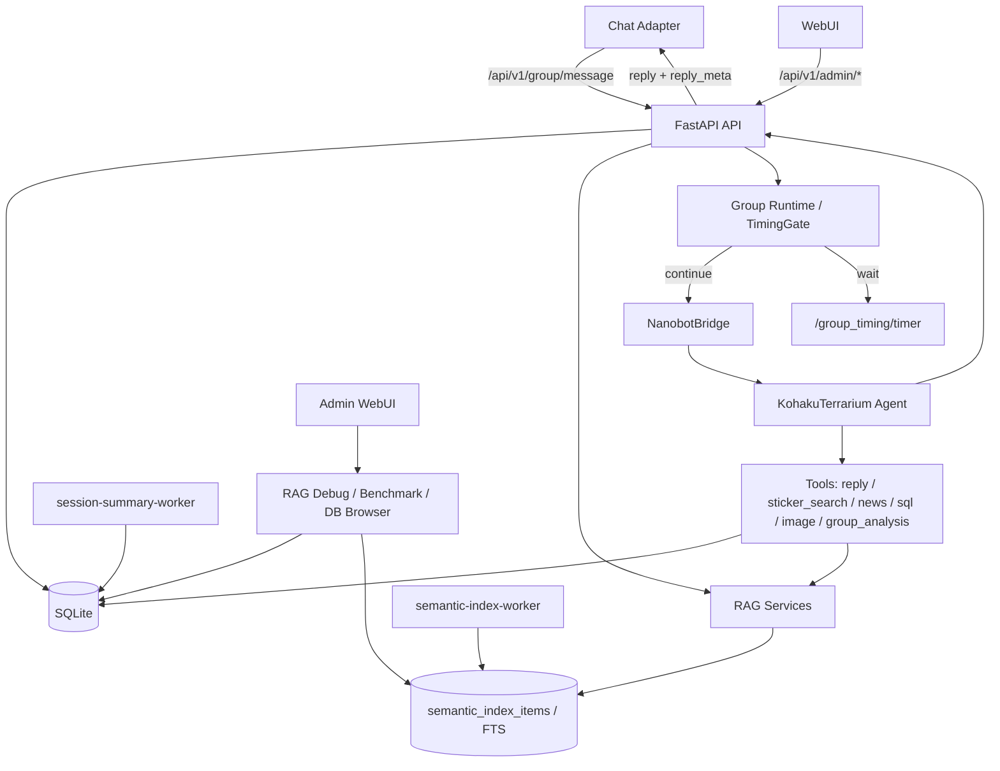

# Nanobot Server

Nanobot Server 是 Nanobot 的服务端运行核心，负责接收聊天适配器 / Web 客户端消息，运行 KohakuTerrarium Agent，维护聊天记忆、群聊运行状态、TimingGate 判定、RAG 语义索引、表情包数据、用户画像、主动外呼、代码执行沙箱、Prompt Runtime 模板和管理后台调试面板。

## 主要能力

- KT Agent 回复链路：基于 `vendor/KohakuTerrarium` 和 `creatures/nanobot` 配置运行。
- 模型路由：支持 new-api / OpenAI 兼容网关、主模型、快模型、回复模型和本地 Qwen 分类 / 视觉模型。
- TimingGate：对群聊消息做 `continue` / `wait` / `no_reply` 判定，支持延迟 timer 和 parse_error 观测。
- 群聊上下文：保留消息、引用、@、指向性、冷却和 generation 信息，减少 bot 打断用户之间定向对话。
- 表情包系统：自动入库、缓存预览、视觉打标、搜索、禁用、去重和使用统计。
- 记忆系统：保存 `ChatLog`、`ConversationTurn`、Persona、Digest、滚动摘要、群记忆和近期上下文。
- 用户画像：从 ChatLog 提取候选，按证据数 / 时间衰减维护置信度，NLI 检测矛盾，注入前按治理策略过滤。
- 主动外呼：按静默时长、话题冷却和概率对超级用户发起主动消息，带租约、幂等投递和 ambiguous 冷静期；默认关闭。
- 代码执行沙箱：`restricted`（一次性容器）与 `developer`（会话型 Lease）两类 Profile，由独立 `sandboxd` 控制面运行容器，模型经 `sandbox_exec` / `poll` / `write_stdin` / `terminate` 与 workspace 文件工具操作；Profile 只能由服务端 `SandboxAccessGrant` 决定，全部硬开关默认关闭且 fail-closed。
- RAG 与语义索引：统一维护 `memory`、`sticker`、`knowledge` 和 `group_memory` 的召回链路；`memory` / `sticker` / `knowledge` 使用 BM25、已存向量和近期上下文混合召回后交给 reranker，`group_memory` 使用 SQL gate 和 reranker。
- RAG Debug / Benchmark：WebUI 支持单次 RAG trace、只读 benchmark、manual / generated case 管理、候选展示和报告查看。
- 只读数据库浏览：Admin DB Browser 以白名单表、列级脱敏、BLOB 安全序列化和 SQL 安全边界展示运行数据。
- SQLite 并发保护：默认启用 `busy_timeout`、WAL，并在群入口与 reply contract tracing 中对写锁做 rollback / backoff 重试。
- Admin WebUI：提供运行总览、群详情、TimingGate、表情包、RAG、Prompt、模型、日志、数据库和设置页面。

## 架构概览



## 目录说明

| 路径 | 用途 |
| --- | --- |
| `server.py` | FastAPI 应用入口、日志、启动检查和后台任务 |
| `api/routes.py` | 普通 API、群聊入口、TimingGate timer、私聊、任务和记忆端点 |
| `api/admin_routes.py` | WebUI 管理 API |
| `api/admin/` | RAG Debug、RAG Benchmark、模型、工具、画像、群记忆、Sandbox 等管理子路由 |
| `app/` | 领域服务模块（session_memory、group_memory、persona、memory_digest、group_learning、group_ingress、prompt_runtime 等） |
| `core/` | 数据库、群运行态、TimingGate、表情包、记忆、RAG、主动外呼、Prompt v2 和配置 |
| `core/sandbox/` | Sandbox Server 侧（授权、Lease/Run 账本、管理操作，不接触 Docker） |
| `sandboxd/` | Sandbox 独立控制面（唯一接触 Docker Socket 与 `/srv/nanobot`，经 UDS 提供服务） |
| `evals/rag_benchmark/` | RAG benchmark case、adapter、runner、scoring 和报告生成 |
| `nanobot_kt/` | KT Bridge、输出适配和工具实现 |
| `creatures/nanobot/` | KT creature 配置、工具说明和运行记忆 |
| `workers/` | Session summary 与语义索引异步 worker |
| `webui/` | Admin WebUI 前端（React + Vite） |
| `vendor/KohakuTerrarium/` | KT 框架子模块 |
| `tests/` | pytest 测试 |

## 快速开始

### 1. 拉取子模块

```bash
git submodule update --init --recursive
```

如果需要固定到发布版 KT：

```bash
git -C vendor/KohakuTerrarium checkout --detach v1.3.0
```

### 2. 准备配置

```bash
cp .env.example .env
```

至少建议配置：

```env
LLM_PROVIDER=new-api
NEW_API_BASE_URL=https://api.example.com/v1
NEW_API_KEY=<your-new-api-key>
NEW_API_TIMEOUT=180

NANOBOT_API_TOKEN=<random-api-token>
NANOBOT_ADMIN_TOKEN=<random-admin-token>
NANOBOT_SUPER_USER_IDS=<comma-separated-user-ids>
NANOBOT_AGENT_STEP_MODEL=<fixed-model-id-for-synergy-agent-step>

DATABASE_URL=sqlite:///./data/nanobot.db
LOG_DIR=./data
LOG_LEVEL=INFO
```

`NANOBOT_SUPER_USER_IDS` 是超级用户权限和主动外呼目标的唯一配置来源，支持英文
或中文逗号分隔。不要把真实 ID 写入源码、受版本控制的配置或 Admin 数据库设置；
需要停用时将变量设为空。修改后必须重启所有读取 `.env` 的服务。

可选本地 Qwen / 分类器：

```env
CLASSIFIER_API_URL=http://host.docker.internal:9999/v1
IMAGE_SUMMARY_API_URL=http://host.docker.internal:9999/v1
```

可选 RAG / 语义索引：

```env
SEMANTIC_INDEX_ENABLED=1
MEMORY_RAG_ENABLED=1
STICKER_RAG_ENABLED=1
KNOWLEDGE_RAG_ENABLED=1
GROUP_MEMORY_RAG_ENABLED=1

RAG_RERANKER_ENABLED=1
RAG_ALLOW_DEGRADED=1
RAG_LOCAL_RERANKER_MODEL=./models/bge-reranker-v2-m3
# 或使用远程 reranker
# RAG_RERANKER_URL=http://host.docker.internal:9001/rerank
```

可选 SQLite 并发参数：

```env
SQLITE_BUSY_TIMEOUT_MS=5000
SQLITE_LOCK_RETRY_ATTEMPTS=4
SQLITE_LOCK_RETRY_BASE_DELAY_SECONDS=0.05
```

### 3. 本地运行

```bash
python -m venv .venv
source .venv/bin/activate
pip install -r requirements.txt
uvicorn server:app --reload --host 0.0.0.0 --port 8000
```

访问：

```text
http://localhost:8000
```

WebUI 管理接口使用 `NANOBOT_ADMIN_TOKEN` 登录。

### 4. Docker 运行

本地构建仍可使用兼容镜像名 `nanobot-runtime:latest`：

```bash
docker compose up -d --build
```

生产环境不从工作树现场构建，也不接受浮动 tag。`Runtime 不可变发布` workflow
只会在同一 master SHA 的 backend、frontend 与 Eval PR Gate 全部成功后构建并推送
GHCR 镜像，生成 SBOM、`ArtifactManifest`、`ReleaseManifest` 和验证结果。服务器应把
该 workflow artifact 下载到独立发布树；生产 checkout 只作为现有 `.env`、数据库和
模型目录来源，不再执行构建、迁移或部署脚本。
下载后先在独立发布树根目录执行 `sha256sum -c runtime-release-<sha>.tar.sha256`，再解包
tar；归档会恢复固定的 `data/release-evidence/<sha>/` 相对路径，不能把证据文件散放或
改名。

```bash
export NANOBOT_PRODUCTION_ROOT='/home/dascard/bot/nanobot'
export NANOBOT_RUNTIME_IMAGE='ghcr.io/<owner>/nanobot-runtime@sha256:<64位摘要>'
export NANOBOT_RELEASE_MANIFEST="$PWD/data/release-evidence/<sha>/release.json"

# 仅首次安装或目录合同变化时执行。
sudo NANOBOT_PRODUCTION_ROOT="${NANOBOT_PRODUCTION_ROOT}" \
  NANOBOT_RUNTIME_UID=10001 NANOBOT_RUNTIME_GID=10001 \
  scripts/prepare-runtime-directories.sh
sudo scripts/manage-prompt-runtime-production.sh prepare

# 日常 Runtime 发布只进入 1 次 sudo。脚本先生成影响计划，再按需审计、备份和切换。
sudo NANOBOT_PRODUCTION_ROOT="${NANOBOT_PRODUCTION_ROOT}" \
  NANOBOT_RUNTIME_IMAGE="${NANOBOT_RUNTIME_IMAGE}" \
  NANOBOT_RELEASE_MANIFEST="${NANOBOT_RELEASE_MANIFEST}" \
  scripts/deploy-production-coordinated.sh
```

协调入口按 ReleaseManifest 与当前发布状态决定实际工作：目标已经运行时直接返回；只有
`prompt_defaults` Hash 变化才生成 Prompt 审计回执；只有数据库 migration head 变化才
创建协调备份；只有 Runtime 身份变化才切换四个固定服务。首次尝试生成的备份目录和业务
前态会写入 `/var/lib/nanobot/release-state/`，同一目标失败后重复执行同一命令只续跑未完成
阶段，不会再备份一次。如果 Prompt 审计发现本地模板漂移，先按输出执行
`plan/resolve/apply`，随后重跑同一协调命令。

只修改 Sandbox 控制面且镜像输入未变化时，不需要 Runtime 发布包，使用另一个单命令入口：

```bash
sudo scripts/manage-sandbox-production.sh upgrade-control-plane \
  --release "$(git rev-parse HEAD)" \
  --release-ref origin/master
```

该入口在同一个 root 进程内完成宿主准备、真实 Smoke、控制面安装和业务开关恢复，并按阶段
回执续跑。Sandbox 镜像输入变化时它会明确拒绝快速通道，此时才执行完整镜像构建链路。

每次提交的 Git SHA 仍然会变化，但这不再等于每次都构建 Runtime。质量门禁会发布
Release Impact；提交不影响 `nanobot-runtime` 时，Runtime workflow 会跳过镜像构建、
SBOM、推送和发布包。Runtime 构建上下文也排除了宿主部署脚本、Sandbox 镜像上下文与
测试依赖，避免运维脚本变更使业务代码层缓存失效。

生产覆盖文件 `docker-compose.prod.yml` 会移除本地 `build` 配置并强制校验 digest。
它还会把 Prompt Runtime 挂载到仓库外 `/var/lib/nanobot/prompt-runtime/`，并用绝对
路径挂载生产 data、models 与 sentinel，避免失败 Git 更新改变 live Prompt。部署入口
先核对 Manifest、按影响要求提供的协调备份或 Prompt 回执、Feature kill switch、活动
Sandbox 和 pull-only 磁盘水位，再把四个固定服务作为不可拆分单元切换；任一 worker、readiness、
Runtime revision、Schema migration head 或非 Nanobot 容器快照验证失败时，会把四个
服务全部恢复到前一镜像。`/var/lib/nanobot/release-state/` 保存 `current.json`、
`pending.json`、`rollback.json` 和历史 ReleaseManifest，用于中断恢复；它不保存环境
变量、Token 或业务正文。镜像身份以 ReleaseManifest 中的精确 RepoDigest 为准；部署器
同时接受 legacy 镜像存储返回的 config Image ID 和 Docker 29 containerd 镜像存储返回
的 OCI 索引 digest，但不接受二者之外的 ID。
前端生产依赖审计当前仍报告 React Router RSC 模式同一 advisory 对应的 2 个 high
包节点；本项目只使用 BrowserRouter SPA，不启用 RSC 或 data-router action，并有静态
回归守卫。Axios 与 form-data 已升级到修复版本。CI 会记录完整 audit 并阻断 Critical；
这 2 个 high 必须在发布报告中继续单列，不能写成“漏洞已全部修复”。React Router 8
要求 Node 22，不能在未调整并验证 Node 20 CI 基线前强行升级。
四个固定服务均以非 root 用户运行，使用只读根文件系统、`cap_drop=ALL`、
`no-new-privileges`、PID/CPU/内存限制和受限 tmpfs。服务端 `/api/v1/health`
只表示进程存活，`/api/v1/ready` 才用于 Compose 与部署 readiness；worker 会等待
服务端 readiness 通过。生产根目录下的 `data/`、`models/`、`sentinel/` 必须预先存在，
不得依赖 Docker 自动创建 root 所有的目录。
已有部署如果存在其他 UID/GID 所有的数据库或模型文件，脚本会先失败并报告首个路径；
完成停服和备份后，才可显式增加 `--fix-existing` 迁移所有权。

`docker-compose.yml` 会同时启动独立的 `session-summary-worker` 和 `semantic-index-worker`。
Compose 已为 Web 服务设置 `NANOBOT_SESSION_SUMMARY_WORKER_MODE=external`，因此不会再在
FastAPI 进程内启动第二个 session-summary consumer：

```bash
python -m workers.session_summary_worker --loop --interval 10
python -m workers.semantic_index_worker --loop --interval 10 --owner semantic-index-worker
```

前者消费 `session_summary_jobs`，异步生成高质量 LLM session summary；后者消费
`semantic_index_jobs`，异步写入统一语义索引。

非 Docker 部署必须为 session-summary 选择唯一运行模式：

- `embedded`：默认值，由 FastAPI 进程内嵌消费；此时不要再启动独立 session-summary worker。
- `external`：用 systemd/supervisor 启动上述独立 worker，并为 Web 服务设置
  `NANOBOT_SESSION_SUMMARY_WORKER_MODE=external`。
- `disabled`：Web 服务和独立进程都不消费 session summary；用于显式停用该能力。

不要同时运行内嵌和独立 session-summary worker。`semantic-index-worker` 始终按独立进程部署。

如果服务器部署需要先更新代码和子模块：

```bash
git pull --ff-only
git submodule sync --recursive
git submodule update --init --recursive
docker compose up -d --build
```

## RAG 与评测

### 召回链路

`memory`、`sticker`、`knowledge` 使用统一语义索引：

1. `semantic-index-worker` 从业务表生成 `semantic_index_items` 和 `semantic_index_fts`。
2. 查询时先做 BM25 / FTS、已存向量 topK、近期或上下文补充召回。
3. 候选经过来源过滤、去重、配额和轻量预评分后进入 reranker。
4. reranker 不可用时会按配置返回 degraded 结果，`fallback_reason` 会说明退化原因。

`group_memory` 不走统一语义索引；它先按群、状态、注入策略、置信度、衰减和证据日志做 SQL gate，再计算分数组件，最后可选 reranker 重排。

### RAG Debug

管理后台的 RAG Debug 用于检查单次查询的召回候选、阶段统计、reranker 状态和 degraded 原因。后端会写入 `rag_debug_runs`，用于回看和导出调试记录。

### RAG Benchmark

RAG Benchmark 用于回归验证 RAG 可用性和排序质量，支持：

- manual case：提交到 `evals/cases/rag_benchmark/manual/`，适合长期回归。
- generated case：从当前 SQLite 数据库只读抽样，写入 `tmp/rag_benchmark/generated/`，不应提交。
- provider mode：`deterministic`（默认，稳定回归）、`no_reranker_baseline`（无 reranker 基线）、`runtime`（真实运行时 provider）。
- WebUI 展示：查询、候选、召回文本、通过率、Hit@K、MRR、degraded 率和延迟指标。

CLI 示例：

```bash
python -m evals.rag_benchmark.sample --db data/nanobot.db --per-source 10
python -m evals.rag_benchmark.run --db data/nanobot.db --provider-mode deterministic
```

Web benchmark 使用 SQLite `mode=ro` 打开数据库，并在运行前预检 `semantic_index_items` 和 `semantic_index_fts`。它不会调用会自动建表或回填索引的路径；缺表时返回 preflight error，而不是静默 DDL。

报告默认写入：

```text
tmp/rag_benchmark/reports/
```

`tmp/rag_benchmark/` 里的 generated case、报告、备份和运行锁都是本地运行产物，不应提交。

## 代码执行沙箱

Sandbox 让模型在隔离容器里执行代码与操作 Workspace 文件，分两层：

- **Server 侧（`core/sandbox/`）**：只经 sandboxd UDS 操作，不挂 Docker Socket、不知道宿主 Workspace 路径；维护 `SandboxAccessGrant` 授权、`SandboxLease` / `SandboxRun` 账本与管理操作，并作为账本唯一写入方由周期 reconciler 主动拉取 sandboxd 事实收敛。
- **控制面（`sandboxd/`）**：唯一接触 Docker Socket 与 `/srv/nanobot` 的组件，负责容器生命周期、出口网络策略、Workspace/Runtime 配额与用量对账。

要点：

- 两类 Profile：`restricted`（一次性断网容器、Python 数据工具）与 `developer`（会话型 Lease、GitHub/PyPI/npm allowlist、完整开发工具链）；`trusted_developer` 为恒 `not_ready` 占位。
- 可用 Profile 只能由 `SandboxAccessGrant` 决定，模型不能在参数中选择镜像、网络或任何 Docker 参数。
- 永久红线：禁 Docker Socket、privileged、host network/PID、宿主根目录、任意 bind mount、跨 Workspace 与长期写凭据。
- 生产默认允许 Sandbox 基础设施接入：`NANOBOT_SANDBOX_INFRASTRUCTURE_ENABLE_ALLOWED=true` 只允许 Web 进一步开启能力，root 仍可在维护或应急时显式设为 `false`；`sandbox.enabled` / `sandbox.exec_enabled` / `sandbox.session_execution_allowed` / `sandbox.developer_network_allowed` 等业务与执行开关继续默认关闭并 fail-closed。

部署、灰度、回滚、备份与安全 / 威胁模型见 `docs/sandbox-operations.md`、`docs/sandbox-rollout-rollback.md`、`docs/sandbox-security-model.md`。真实隔离矩阵（AppArmor、宿主 project quota、六组特权 Docker 验收）需在部署宿主完成，未验收前生产保持 `BLOCKED`。

## 主动外呼

主动外呼（`core/proactive/`）由后台调度器按静默时长、最大检查间隔、话题冷却和概率对超级用户发起主动消息，经 Judge 评估、grounding 校验后走幂等出站投递，带租约与 ambiguous 冷静期。能力默认关闭（`proactive_outreach.enabled`），目标用户仅来自 `NANOBOT_SUPER_USER_IDS`；管理端可 `run-once`（check / due）演练，阈值与后台调度器共用同一托管配置。

## 数据库与并发

默认 SQLite 连接会设置：

- `PRAGMA busy_timeout`：默认 5000 ms，可用 `SQLITE_BUSY_TIMEOUT_MS` 调整。
- `PRAGMA journal_mode=WAL`：降低读写互相阻塞的概率。
- `PRAGMA synchronous=NORMAL`：配合 WAL 降低写入开销。

群消息入口和 reply contract tracing 对短暂 `database is locked` 会先 rollback，再按 `SQLITE_LOCK_RETRY_ATTEMPTS` 和 `SQLITE_LOCK_RETRY_BASE_DELAY_SECONDS` 做退避重试。Tracing 写入失败会降级为日志警告，不应中断主回复链路。

Admin DB Browser 只面向管理员调试使用：

- `/db/tables` 只返回白名单表和分组元数据。
- `/db/tables/{table_name}` 只能查询白名单表，默认分页，`limit` 最大 200。
- `/db/query` 只允许安全 `SELECT`，并阻止 `sensitive_data`、SQLite 系统表和非白名单表。
- BLOB 全局序列化为 `<binary N bytes>`；长文本默认返回预览和截断标记。

## 常用 API

普通 API 前缀为 `/api/v1`，管理 API 前缀为 `/api/v1/admin`。

消息入口字段约定见 [`docs/message-field-standard.md`](docs/message-field-standard.md)。

| 端点 | 说明 |
| --- | --- |
| `POST /api/v1/chat` | 私聊 / Web 聊天入口 |
| `POST /api/v1/group/message` | 群聊统一入口 |
| `POST /api/v1/group_timing/timer` | 延迟回复 timer 回调 |
| `POST /api/v1/stickers/register` | 注册表情包 |
| `GET /api/v1/stickers/search` | 搜索表情包 |
| `GET /api/v1/health` | 服务健康检查 |
| `GET /api/v1/admin/overview` | WebUI 首页总览数据 |
| `GET /api/v1/admin/groups` | 群聊运行状态 |
| `GET /api/v1/admin/timing-gate/events` | TimingGate 事件与统计 |
| `GET /api/v1/admin/stickers` | 表情包管理 |
| `POST /api/v1/admin/rag/debug/query` | 单次 RAG Debug 查询 |
| `GET /api/v1/admin/rag/debug/status` | RAG 索引与 reranker 状态 |
| `POST /api/v1/admin/rag/debug/build-index` | 手动触发语义索引构建 |
| `GET /api/v1/admin/rag/benchmark/status` | RAG Benchmark 预检和目录状态 |
| `GET /api/v1/admin/rag/benchmark/cases` | 查看 benchmark case 列表 |
| `POST /api/v1/admin/rag/benchmark/sample` | 从当前数据库只读抽样 generated case |
| `POST /api/v1/admin/rag/benchmark/run` | 执行 RAG Benchmark |
| `GET /api/v1/admin/rag/benchmark/reports/latest` | 查看最近一次 benchmark 报告 |
| `GET /api/v1/admin/prompt` | Prompt Runtime 预览 / 模板管理相关数据 |
| `GET /api/v1/admin/models/status` | 模型状态 |
| `GET /api/v1/admin/persona/users` | 用户画像列表与注入预览 |
| `GET /api/v1/admin/proactive-outreach/*` | 主动外呼配置、run-once 演练与投递记录 |
| `GET /api/v1/admin/sandbox/status` | Sandbox readiness、Profile 与开关状态 |
| `POST /api/v1/admin/sandbox/access-grants` | 授予 / 变更会话 Sandbox 能力与 Profile |
| `GET /api/v1/admin/sandbox/leases` | Sandbox Lease 列表与安全投影 |
| `GET /api/v1/admin/db/tables` | 只读数据库表清单 |
| `GET /api/v1/admin/db/tables/{table_name}` | 只读分页查看白名单表 |
| `POST /api/v1/admin/db/query` | 受限只读 SQL 查询 |
| `GET /api/v1/admin/logs` | 日志列表 |

## Prompt Runtime 模板

默认模板位于：

```text
prompts.v2.default/
```

开发环境的兼容运行时副本位于：

```text
data/prompts_v2/
```

生产环境不使用上述 checkout 内目录，而是通过
`NANOBOT_PROMPT_RUNTIME_DIR=/var/lib/nanobot/prompt-runtime/live/runtime` 使用仓库外
可变状态。升级必须执行 audit → plan/resolve → 人工审查 → apply，并由目标 digest
生成审计回执；初始化和迁移只复制或显式处理，不静默覆盖管理员修改。修改对话组装、
历史注入、工具契约或任务 prompt 时，仍需同步检查 canonical 默认模板和变量白名单。

常用检查：

```bash
python -B -m pytest tests/test_prompt_v2.py tests/test_prompt_manifest.py -q -p no:cacheprovider
```

## 测试

全量测试使用 pytest-xdist 并行，并由 pytest-timeout 兜底防止卡死用例无限挂起（配置见 `pytest.ini`）：

```bash
python -m pytest tests/ -n auto --dist loadfile -v
```

20 核并行约 2 分钟。调试单文件 / 单测直接运行，不加 `-n`（避免 worker 启动开销）：

```bash
python -m pytest tests/test_<module>.py -v
```

常用局部测试：

```bash
python -m pytest tests/test_kt_framework.py tests/test_bridge_integration.py tests/test_sticker_tool.py -q
python -m pytest tests/test_timing_runtime.py -q
python -m pytest tests/test_admin_api.py -q
python -m pytest tests/test_admin_db_browser.py tests/test_rag_debug.py -q
python -m pytest tests/test_rag_benchmark.py tests/test_rag_benchmark_admin.py -q
python -m pytest tests/test_persona_preprocess.py tests/test_group_memory_rag.py -q
python -m pytest tests/test_proactive_outreach.py tests/test_admin_proactive_outreach.py -q
python -m pytest "tests/test_sandbox_*.py" "tests/test_sandboxd_*.py" -q
python -m pytest tests/test_tracing_sqlite_retry.py tests/test_database.py -q
```

## License

请在公开发布前补充明确的许可证文件。
