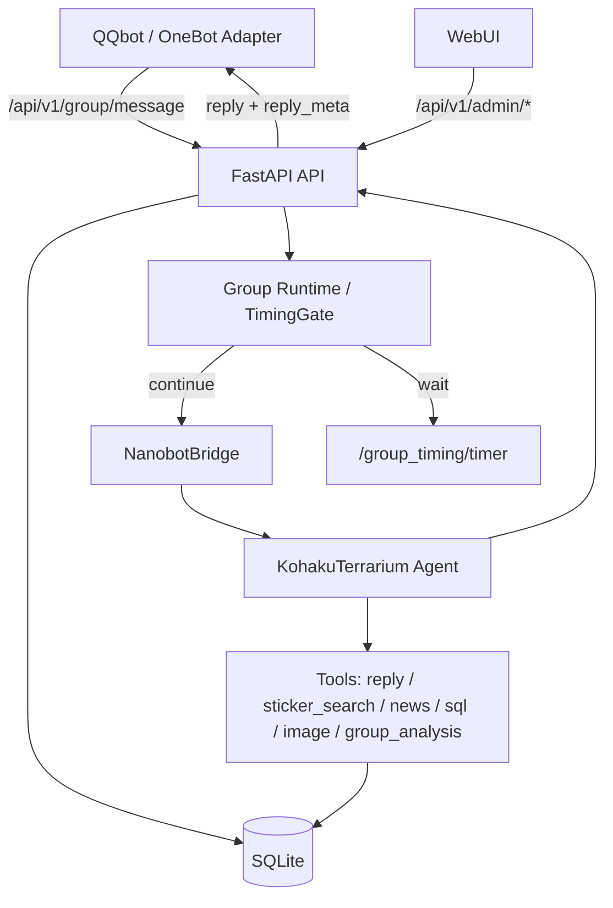

# Nanobot Server

Nanobot Server 是 Nanobot 的服务端运行核心，负责接收 QQbot / Web 客户端消息，运行 KohakuTerrarium Agent，维护聊天记忆、群聊运行状态、TimingGate 判定、表情包数据和 Prompt 构建结果。

这个仓库关注的是 Nanobot 端能力：运行可观测性、模型判定调试、记忆 / 表情包 / Prompt 数据治理。QQbot 插件开关和平台适配逻辑应放在 QQbot 端。

## 主要能力

- KT Agent 回复链路：基于 `vendor/KohakuTerrarium` 和 `creatures/nanobot` 配置运行。
- 模型路由：支持 new-api / OpenAI 兼容网关、主模型、快模型、回复模型和本地 Qwen 分类 / 视觉模型。
- TimingGate：对群聊消息做 `continue` / `wait` / `no_reply` 判定，支持延迟 timer 和 parse_error 观测。
- 群聊上下文：保留消息、引用、@、指向性、冷却和 generation 信息，减少 bot 打断用户之间定向对话。
- 表情包系统：自动入库、缓存预览、视觉打标、搜索、禁用、去重和使用统计。
- 记忆系统：保存 `ChatLog`、`ConversationTurn`、Persona、Digest、群记忆和近期上下文。
- Admin WebUI：提供运行总览、群详情、TimingGate、表情包、Prompt、模型、日志、数据库和设置页面。

## 架构概览



## 目录说明

| 路径 | 用途 |
| --- | --- |
| `server.py` | FastAPI 应用入口、日志、启动检查和后台任务 |
| `api/routes.py` | 普通 API、群聊入口、TimingGate timer、私聊、任务和记忆端点 |
| `api/admin_routes.py` | WebUI 管理 API |
| `core/` | 数据库、群运行态、TimingGate、表情包、记忆和配置 |
| `nanobot_kt/` | KT Bridge、输出适配和工具实现 |
| `creatures/nanobot/` | KT creature 配置、Prompt fragment 和工具说明 |
| `webui/` | Admin WebUI 前端 |
| `vendor/KohakuTerrarium/` | KT 框架子模块 |
| `tests/` | pytest 测试 |

## 快速开始

### 1. 拉取子模块

```bash
git submodule update --init --recursive
```

如果需要固定到发布版 KT：

```bash
git -C vendor/KohakuTerrarium checkout --detach v1.3.0
```

### 2. 准备配置

```bash
cp .env.example .env
```

至少建议配置：

```env
LLM_PROVIDER=new-api
NEW_API_BASE_URL=https://api.example.com/v1
NEW_API_KEY=<your-new-api-key>
NEW_API_TIMEOUT=180

NANOBOT_API_TOKEN=<random-api-token>
NANOBOT_ADMIN_TOKEN=<random-admin-token>

DATABASE_URL=sqlite:///./data/nanobot.db
LOG_DIR=./data
LOG_LEVEL=INFO
```

可选本地 Qwen / 分类器：

```env
CLASSIFIER_API_URL=http://host.docker.internal:9999/v1
IMAGE_SUMMARY_API_URL=http://host.docker.internal:9999/v1
```

### 3. 本地运行

```bash
python -m venv .venv
source .venv/bin/activate
pip install -r requirements.txt
uvicorn server:app --reload --host 0.0.0.0 --port 8000
```

访问：

```text
http://localhost:8000
```

WebUI 管理接口使用 `NANOBOT_ADMIN_TOKEN` 登录。

### 4. Docker 运行

```bash
docker compose up -d --build
```

如果服务器部署需要先更新代码和子模块：

```bash
git pull --ff-only
git submodule sync --recursive
git submodule update --init --recursive
docker compose up -d --build
```

## 常用 API

普通 API 前缀为 `/api/v1`，管理 API 前缀为 `/api/v1/admin`。

| 端点 | 说明 |
| --- | --- |
| `POST /api/v1/chat` | 私聊 / Web 聊天入口 |
| `POST /api/v1/group/message` | 群聊统一入口 |
| `POST /api/v1/group_timing/timer` | 延迟回复 timer 回调 |
| `POST /api/v1/stickers/register` | 注册表情包 |
| `GET /api/v1/stickers/search` | 搜索表情包 |
| `GET /api/v1/health` | 服务健康检查 |
| `GET /api/v1/admin/overview` | WebUI 首页总览数据 |
| `GET /api/v1/admin/groups` | 群聊运行状态 |
| `GET /api/v1/admin/timing-gate/events` | TimingGate 事件与统计 |
| `GET /api/v1/admin/stickers` | 表情包管理 |
| `GET /api/v1/admin/prompt` | Prompt 预览 / 构建相关数据 |
| `GET /api/v1/admin/models/status` | 模型状态 |
| `GET /api/v1/admin/logs` | 日志列表 |

## Prompt 构建

Prompt fragment 位于：

```text
creatures/nanobot/prompts/
```

构建并检查：

```bash
python scripts/build_nanobot_prompt.py --check
python scripts/build_nanobot_prompt.py
```

生成结果写入：

```text
creatures/nanobot/prompt.md
```

## 测试

```bash
python -m pytest tests/ -v
```

常用局部测试：

```bash
python -m pytest tests/test_kt_framework.py tests/test_bridge_integration.py tests/test_sticker_tool.py -q
python -m pytest tests/test_timing_runtime.py tests/test_timing_gate.py -q
python -m pytest tests/test_admin_api.py -q
```

## License

请在公开发布前补充明确的许可证文件。
