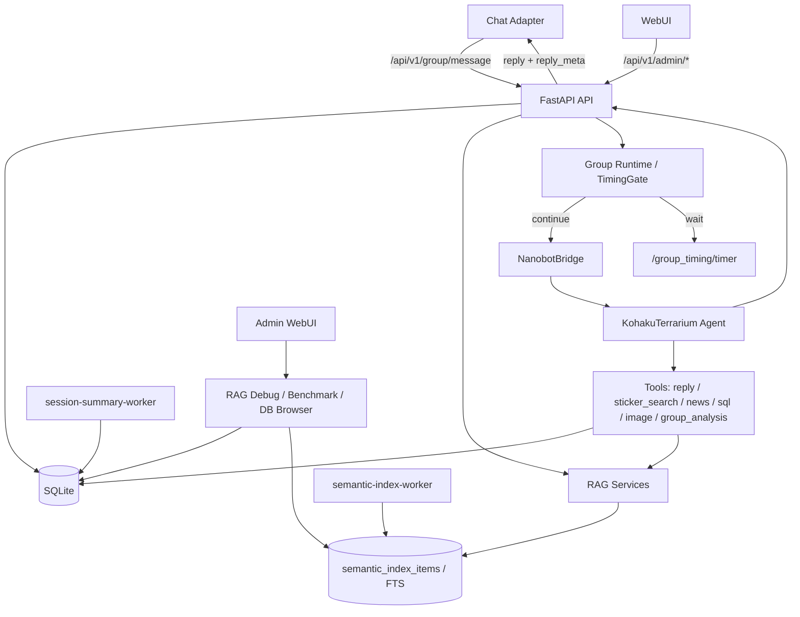

# Nanobot Server

Nanobot Server 是 Nanobot 的服务端运行核心，负责接收聊天适配器 / Web 客户端消息，运行 KohakuTerrarium Agent，维护聊天记忆、群聊运行状态、TimingGate 判定、RAG 语义索引、表情包数据、Prompt Runtime 模板和管理后台调试面板。

## 主要能力

- KT Agent 回复链路：基于 `vendor/KohakuTerrarium` 和 `creatures/nanobot` 配置运行。
- 模型路由：支持 new-api / OpenAI 兼容网关、主模型、快模型、回复模型和本地 Qwen 分类 / 视觉模型。
- TimingGate：对群聊消息做 `continue` / `wait` / `no_reply` 判定，支持延迟 timer 和 parse_error 观测。
- 群聊上下文：保留消息、引用、@、指向性、冷却和 generation 信息，减少 bot 打断用户之间定向对话。
- 表情包系统：自动入库、缓存预览、视觉打标、搜索、禁用、去重和使用统计。
- 记忆系统：保存 `ChatLog`、`ConversationTurn`、Persona、Digest、滚动摘要、群记忆和近期上下文。
- RAG 与语义索引：统一维护 `memory`、`sticker`、`knowledge` 和 `group_memory` 的召回链路；`memory` / `sticker` / `knowledge` 使用 BM25、已存向量和近期上下文混合召回后交给 reranker，`group_memory` 使用 SQL gate 和 reranker。
- RAG Debug / Benchmark：WebUI 支持单次 RAG trace、只读 benchmark、manual / generated case 管理、候选展示和报告查看。
- 只读数据库浏览：Admin DB Browser 以白名单表、列级脱敏、BLOB 安全序列化和 SQL 安全边界展示运行数据。
- SQLite 并发保护：默认启用 `busy_timeout`、WAL，并在群入口与 reply contract tracing 中对写锁做 rollback / backoff 重试。
- Admin WebUI：提供运行总览、群详情、TimingGate、表情包、RAG、Prompt、模型、日志、数据库和设置页面。

## 架构概览



## 目录说明

| 路径 | 用途 |
| --- | --- |
| `server.py` | FastAPI 应用入口、日志、启动检查和后台任务 |
| `api/routes.py` | 普通 API、群聊入口、TimingGate timer、私聊、任务和记忆端点 |
| `api/admin_routes.py` | WebUI 管理 API |
| `api/admin/` | RAG Debug、RAG Benchmark 等管理子路由 |
| `core/` | 数据库、群运行态、TimingGate、表情包、记忆、RAG 和配置 |
| `evals/rag_benchmark/` | RAG benchmark case、adapter、runner、scoring 和报告生成 |
| `nanobot_kt/` | KT Bridge、输出适配和工具实现 |
| `creatures/nanobot/` | KT creature 配置、工具说明和运行记忆 |
| `workers/` | Session summary 与语义索引异步 worker |
| `webui/` | Admin WebUI 前端 |
| `vendor/KohakuTerrarium/` | KT 框架子模块 |
| `tests/` | pytest 测试 |

## 快速开始

### 1. 拉取子模块

```bash
git submodule update --init --recursive
```

如果需要固定到发布版 KT：

```bash
git -C vendor/KohakuTerrarium checkout --detach v1.3.0
```

### 2. 准备配置

```bash
cp .env.example .env
```

至少建议配置：

```env
LLM_PROVIDER=new-api
NEW_API_BASE_URL=https://api.example.com/v1
NEW_API_KEY=<your-new-api-key>
NEW_API_TIMEOUT=180

NANOBOT_API_TOKEN=<random-api-token>
NANOBOT_ADMIN_TOKEN=<random-admin-token>
NANOBOT_AGENT_STEP_MODEL=<fixed-model-id-for-synergy-agent-step>

DATABASE_URL=sqlite:///./data/nanobot.db
LOG_DIR=./data
LOG_LEVEL=INFO
```

可选本地 Qwen / 分类器：

```env
CLASSIFIER_API_URL=http://host.docker.internal:9999/v1
IMAGE_SUMMARY_API_URL=http://host.docker.internal:9999/v1
```

可选 RAG / 语义索引：

```env
SEMANTIC_INDEX_ENABLED=1
MEMORY_RAG_ENABLED=1
STICKER_RAG_ENABLED=1
KNOWLEDGE_RAG_ENABLED=1
GROUP_MEMORY_RAG_ENABLED=1

RAG_RERANKER_ENABLED=1
RAG_ALLOW_DEGRADED=1
RAG_LOCAL_RERANKER_MODEL=./models/bge-reranker-v2-m3
# 或使用远程 reranker
# RAG_RERANKER_URL=http://host.docker.internal:9001/rerank
```

可选 SQLite 并发参数：

```env
SQLITE_BUSY_TIMEOUT_MS=30000
SQLITE_LOCK_RETRY_ATTEMPTS=4
SQLITE_LOCK_RETRY_BASE_DELAY_SECONDS=0.05
```

### 3. 本地运行

```bash
python -m venv .venv
source .venv/bin/activate
pip install -r requirements.txt
uvicorn server:app --reload --host 0.0.0.0 --port 8000
```

访问：

```text
http://localhost:8000
```

WebUI 管理接口使用 `NANOBOT_ADMIN_TOKEN` 登录。

### 4. Docker 运行

```bash
docker compose up -d --build
```

`docker-compose.yml` 会同时启动独立的 `session-summary-worker` 和 `semantic-index-worker`：

```bash
python -m workers.session_summary_worker --loop --interval 10
python -m workers.semantic_index_worker --loop --interval 10 --owner semantic-index-worker
```

前者消费 `session_summary_jobs`，异步生成高质量 LLM session summary；后者消费
`semantic_index_jobs`，异步写入统一语义索引。不要把这些 worker 塞进 FastAPI Web
进程；单机部署用 compose 服务，非 Docker 部署用 systemd/supervisor 以同一命令常驻运行。

如果服务器部署需要先更新代码和子模块：

```bash
git pull --ff-only
git submodule sync --recursive
git submodule update --init --recursive
docker compose up -d --build
```

## RAG 与评测

### 召回链路

`memory`、`sticker`、`knowledge` 使用统一语义索引：

1. `semantic-index-worker` 从业务表生成 `semantic_index_items` 和 `semantic_index_fts`。
2. 查询时先做 BM25 / FTS、已存向量 topK、近期或上下文补充召回。
3. 候选经过来源过滤、去重、配额和轻量预评分后进入 reranker。
4. reranker 不可用时会按配置返回 degraded 结果，`fallback_reason` 会说明退化原因。

`group_memory` 不走统一语义索引；它先按群、状态、注入策略、置信度、衰减和证据日志做 SQL gate，再计算分数组件，最后可选 reranker 重排。

### RAG Debug

管理后台的 RAG Debug 用于检查单次查询的召回候选、阶段统计、reranker 状态和 degraded 原因。后端会写入 `rag_debug_runs`，用于回看和导出调试记录。

### RAG Benchmark

RAG Benchmark 用于回归验证 RAG 可用性和排序质量，支持：

- manual case：提交到 `evals/cases/rag_benchmark/manual/`，适合长期回归。
- generated case：从当前 SQLite 数据库只读抽样，写入 `tmp/rag_benchmark/generated/`，不应提交。
- provider mode：`deterministic`（默认，稳定回归）、`no_reranker_baseline`（无 reranker 基线）、`runtime`（真实运行时 provider）。
- WebUI 展示：查询、候选、召回文本、通过率、Hit@K、MRR、degraded 率和延迟指标。

CLI 示例：

```bash
python -m evals.rag_benchmark.sample --db data/nanobot.db --per-source 10
python -m evals.rag_benchmark.run --db data/nanobot.db --provider-mode deterministic
```

Web benchmark 使用 SQLite `mode=ro` 打开数据库，并在运行前预检 `semantic_index_items` 和 `semantic_index_fts`。它不会调用会自动建表或回填索引的路径；缺表时返回 preflight error，而不是静默 DDL。

报告默认写入：

```text
tmp/rag_benchmark/reports/
```

`tmp/rag_benchmark/` 里的 generated case、报告、备份和运行锁都是本地运行产物，不应提交。

## 数据库与并发

默认 SQLite 连接会设置：

- `PRAGMA busy_timeout`：默认 30000 ms，可用 `SQLITE_BUSY_TIMEOUT_MS` 调整。
- `PRAGMA journal_mode=WAL`：降低读写互相阻塞的概率。
- `PRAGMA synchronous=NORMAL`：配合 WAL 降低写入开销。

群消息入口和 reply contract tracing 对短暂 `database is locked` 会先 rollback，再按 `SQLITE_LOCK_RETRY_ATTEMPTS` 和 `SQLITE_LOCK_RETRY_BASE_DELAY_SECONDS` 做退避重试。Tracing 写入失败会降级为日志警告，不应中断主回复链路。

Admin DB Browser 只面向管理员调试使用：

- `/db/tables` 只返回白名单表和分组元数据。
- `/db/tables/{table_name}` 只能查询白名单表，默认分页，`limit` 最大 200。
- `/db/query` 只允许安全 `SELECT`，并阻止 `sensitive_data`、SQLite 系统表和非白名单表。
- BLOB 全局序列化为 `<binary N bytes>`；长文本默认返回预览和截断标记。

## 常用 API

普通 API 前缀为 `/api/v1`，管理 API 前缀为 `/api/v1/admin`。

消息入口字段约定见 [`docs/message-field-standard.md`](docs/message-field-standard.md)。

| 端点 | 说明 |
| --- | --- |
| `POST /api/v1/chat` | 私聊 / Web 聊天入口 |
| `POST /api/v1/group/message` | 群聊统一入口 |
| `POST /api/v1/group_timing/timer` | 延迟回复 timer 回调 |
| `POST /api/v1/stickers/register` | 注册表情包 |
| `GET /api/v1/stickers/search` | 搜索表情包 |
| `GET /api/v1/health` | 服务健康检查 |
| `GET /api/v1/admin/overview` | WebUI 首页总览数据 |
| `GET /api/v1/admin/groups` | 群聊运行状态 |
| `GET /api/v1/admin/timing-gate/events` | TimingGate 事件与统计 |
| `GET /api/v1/admin/stickers` | 表情包管理 |
| `POST /api/v1/admin/rag/debug/query` | 单次 RAG Debug 查询 |
| `GET /api/v1/admin/rag/debug/status` | RAG 索引与 reranker 状态 |
| `POST /api/v1/admin/rag/debug/build-index` | 手动触发语义索引构建 |
| `GET /api/v1/admin/rag/benchmark/status` | RAG Benchmark 预检和目录状态 |
| `GET /api/v1/admin/rag/benchmark/cases` | 查看 benchmark case 列表 |
| `POST /api/v1/admin/rag/benchmark/sample` | 从当前数据库只读抽样 generated case |
| `POST /api/v1/admin/rag/benchmark/run` | 执行 RAG Benchmark |
| `GET /api/v1/admin/rag/benchmark/reports/latest` | 查看最近一次 benchmark 报告 |
| `GET /api/v1/admin/prompt` | Prompt Runtime 预览 / 模板管理相关数据 |
| `GET /api/v1/admin/models/status` | 模型状态 |
| `GET /api/v1/admin/db/tables` | 只读数据库表清单 |
| `GET /api/v1/admin/db/tables/{table_name}` | 只读分页查看白名单表 |
| `POST /api/v1/admin/db/query` | 受限只读 SQL 查询 |
| `GET /api/v1/admin/logs` | 日志列表 |

## Prompt Runtime 模板

默认模板位于：

```text
prompts.v2.default/
```

运行时可编辑模板位于：

```text
data/prompts_v2/
```

服务启动时会通过 `bootstrap/prompt_runtime.py` 初始化运行时模板目录，只复制缺失模板，不覆盖已有运行时修改。修改对话组装、历史注入、工具契约或任务 prompt 时，需要同步检查默认模板、运行时模板和变量白名单。

常用检查：

```bash
python -B -m pytest tests/test_prompt_v2.py tests/test_prompt_manifest.py -q -p no:cacheprovider
```

## 测试

```bash
python -m pytest tests/ -v
```

常用局部测试：

```bash
python -m pytest tests/test_kt_framework.py tests/test_bridge_integration.py tests/test_sticker_tool.py -q
python -m pytest tests/test_timing_runtime.py tests/test_timing_gate.py -q
python -m pytest tests/test_admin_api.py -q
python -m pytest tests/test_admin_db_browser.py tests/test_rag_debug.py -q
python -m pytest tests/test_rag_benchmark.py tests/test_rag_benchmark_admin.py tests/test_rag_benchmark_webui.py -q
python -m pytest tests/test_tracing_sqlite_retry.py tests/test_database.py -q
```

## License

请在公开发布前补充明确的许可证文件。
