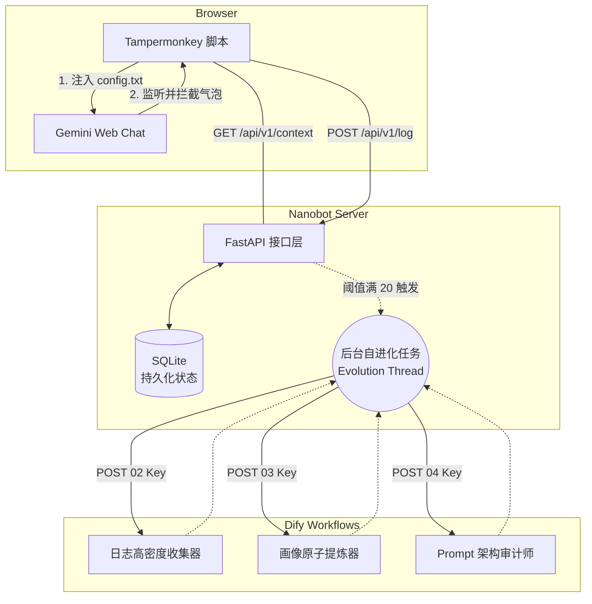

# Nanobot Server (v4 Headless Dify Controller)

Nanobot Server 是一个独立的自进化 Python 微服务网关。它与 Dify 分离，通过 Tampermonkey 脚本对 Gemini Web 网页端进行浏览器端“无痛注入”以实现持久化记忆和系统角色护栏。

## 架构



## 本地开发启动

```bash
# 安装依赖
pip install -r requirements.txt

# 运行服务器 (热重载模式)
uvicorn server:app --reload --port 8000
```

## Docker 部署

```bash
# 复制并配置你的 .env 文件
cp .env.example .env

# 构建并启动
docker-compose up -d --build
```
