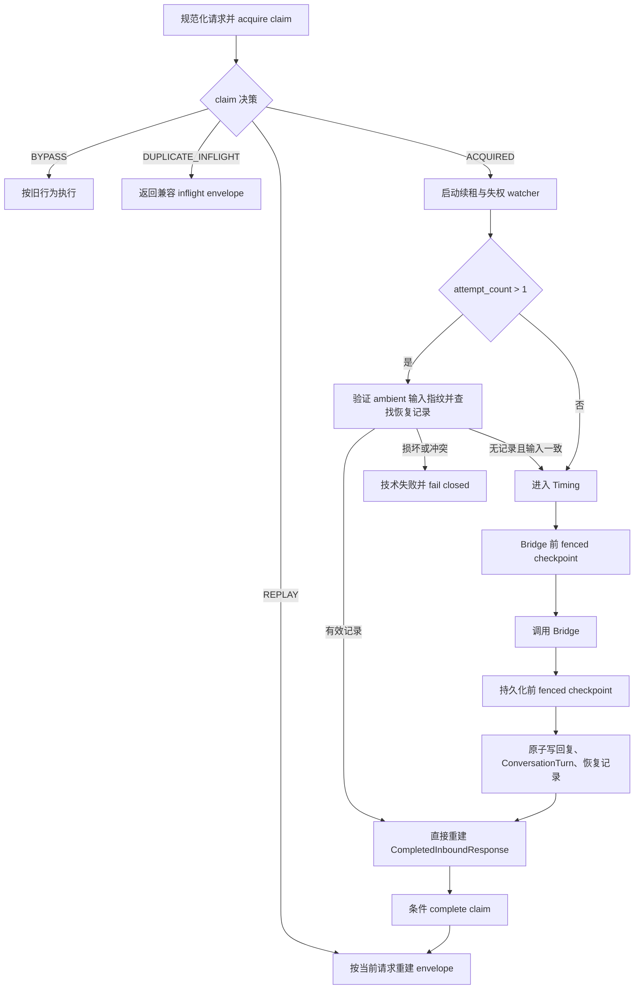

# 群聊入站 Claim 可恢复提交协议设计

- 日期：2026-07-11
- 状态：已确认并实现
- 关联计划：`.codex/plans/architecture-remediation-stage2.md` 的 Task 3C

## 背景

架构整改第二阶段已经为 `/chat` 和 `/group/message` 接入持久化入站 claim。相同的
`(platform, chat_type, session_id, message_id)` 只允许一个 owner 执行业务；完成结果可重放，
在途重复请求返回 `duplicate_inflight`，失败或租约过期的请求可以被新 owner 接管。

Task 3C 的主流程已经满足基础功能规格，但代码质量审查发现三类恢复缺口：

1. 部分 Timing scoring shortcut 会调用 `mark_gate_start()`，却没有注册异常回滚目标。
2. 当前 gate abort 只恢复 `running` 和 `last_gate_completed_ts`，无法恢复已经被清空的
   pending、wait、linger 和 proactive budget。
3. Bridge 回复可能已经写入 `ChatLog`，随后 claim complete 失败。下一次 failed takeover
   只看到 failed claim，会再次进入 Timing 和 Bridge，存在重复外部副作用风险。

同时还存在若干放大上述风险的问题：续租丢失 owner 后旧任务仍可继续执行；同步
SQLAlchemy 和 SQLite backoff 位于事件循环线程；failed takeover 可能把旧 ambient meta
和新请求正文混合；重复 `message_id` 会刷新 wait；技术错误与 claim 结算错误之间的关系
可能丢失。

本设计在现有单机 SQLite 架构内补齐可恢复提交协议。服务仍限定在可信内网，继续使用
单一服务间 Bearer Token。启动日志继续输出完整 `NANOBOT_ADMIN_TOKEN`，不在本设计范围内。

## 术语

- **canonical message identity：** 归一化后的
  `(platform, chat_type, session_id, message_id)`。
- **owner：** 持有随机 `owner_token`、可续租并能条件终结 claim 的当前执行者。
- **fencing：** 所有 renew、checkpoint、complete 和 fail 都必须同时匹配
  `processing` 状态与 `owner_token`；旧 owner 不得写入终态。
- **business completion：** `respond`、`no_reply`、`silent`、`wait` 或 `blocked` 等合法业务
  终态，使用 `CompletedInboundResponse` 表达。
- **technical failure：** 数据库锁、Timing、Bridge、审计或 claim 生命周期异常等不能当作
  合法业务终态的失败。
- **gate transaction：** 从 `_begin_gate()` 保存状态快照并置 `running=True`，到完整响应构造
  后 commit，或在 `BaseException` 时 abort 的内存事务。
- **recoverable completion：** 与 Bridge 回复在同一 SQLite 事务内写入 `ChatLog.meta_json` 的
  版本化 `CompletedInboundResponse` 恢复记录。

## 目标

1. 所有会消费或改变 GroupRuntime gate 状态的路径使用同一套 begin、commit、abort 生命周期。
2. gate 在异常、任务取消和清理异常时恢复完整 gate-relevant state，不伪造成功冷却。
3. 非空 Bridge 回复一旦持久化，后续 failed takeover 可以确定性恢复原业务结果，不再次调用
   Timing 或 Bridge。
4. failed takeover 只能复用同一份业务输入，禁止形成“旧 ambient meta + 新正文或新 sender”
   的混合请求。
5. owner 续租异常或失权时尽快取消旧业务，并在 Bridge 与回复持久化前执行 fresh fenced
   checkpoint。
6. owner 的 fresh Session 创建、SQLAlchemy 操作、SQLite backoff 和关闭全部在线程池执行，
   不阻塞 ASGI 事件循环。
7. `GroupIngressResult` 穷尽表达 business completion 与 technical failure，并保留主错误和
   claim 结算错误的完整异常链。
8. 保持现有 HTTP envelope、群聊 transport 格式化、图片引用展开及空 `message_id` 兼容行为。

## 非目标

- 不新增数据库表、列、唯一约束或迁移。
- 不引入 outbox、步骤账本、Redis、消息队列、分布式锁或微服务。
- 不承诺当前单实例进程之外的水平扩展能力。
- 不为不支持 idempotency key 的下游工具提供数学意义上的 exactly-once。
- 不修改 `/chat` 已完成的幂等协议语义。
- 不提前执行 Stage 2 Task 4 的 `api/task_routes.py` 和 Admin Persona Session 整改。
- 不修改 `enriched_query`、历史注入、conversation 结构、工具输出契约或 Prompt Runtime 模板。
- 不修改 `bootstrap/network_check.py`，也不改变完整 Admin Token 的启动日志行为。

## 核心不变量

| 编号 | 不变量 |
|---|---|
| I-1 | 非空 `message_id` 的群请求在任何业务副作用前完成 claim 裁决。 |
| I-2 | 同一时刻只有匹配当前 `owner_token` 的执行者可以续租、checkpoint 或写 claim 终态。 |
| I-3 | `GroupIngressResult.completion` 与 `technical_error` 恰好一个非空。 |
| I-4 | HTTP payload 只从当前请求与传输无关的 `CompletedInboundResponse` 组装，持久化结果不保存请求绑定身份。 |
| I-5 | 非空 Bridge 回复、ConversationTurn 与 recoverable completion 使用同一次数据库 commit。 |
| I-6 | 检测到已持久化但损坏、冲突或无法验证的恢复记录时 fail closed，禁止再次进入 Bridge。 |
| I-7 | gate abort 不得丢失 gate 开始后新到达的消息，也不得把失败 gate 计为成功冷却。 |
| I-8 | 相同非空 `message_id` 不重复加入 pending，不增加 generation，也不刷新 wait deadline。 |
| I-9 | owner 失权后不得持久化回复、完成 claim 或向调用方返回成功业务 payload。 |
| I-10 | 任何 settlement 或 rollback 失败不得覆盖最初的业务、取消或参数校验异常。 |

## 方案比较

### 方案 A：复用 `ChatLog.message_id` 与 `meta_json`（采用）

非空 Bridge 回复本来就需要写入 `ChatLog`。在同一行设置 canonical `message_id`，并在
`meta_json` 中附加严格版本化的 recoverable completion，可以让回复内容、对话工作内存和
恢复凭据共享同一个 SQLite commit。claim complete 失败后，新 owner 可以从已有档案恢复，
无需新增跨表提交步骤。

优点：不改 schema；恢复记录与回复原子提交；符合 `ChatLog` 作为原始档案的职责；改动集中在
群入口、持久化 helper 和既有 claim lifecycle。

代价：`meta_json` 需要严格 codec；旧数据没有恢复记录；查询后需要在 Python 中验证 marker、
claim identity 和请求指纹。

### 方案 B：新增 outbox 或步骤账本表（不采用）

独立 outbox 可以更完整地记录每个不可逆步骤，也更适合多进程消费。但它会引入新表、迁移、
dispatcher、清理与重放状态机，超出当前单实例可信内网部署的需求和已批准范围。

### 方案 C：只依赖 lease、取消和终态 fencing（不采用）

lease 与 fencing 能阻止旧 owner 覆盖新终态，却不能回答“Bridge 回复是否已经持久化”。如果
complete 在回复 commit 之后失败，单靠 claim 表无法区分“尚未调用 Bridge”和“回复已落库”，
因此不能安全重试。

## 总体设计



职责分配如下：

- `GroupIngressService` 负责 claim 决策、业务 task 与失权信号竞速、checkpoint 点位、恢复分支、
  typed result 和最终结算。
- `InboundClaimOwner` 负责 fresh-Session renew/checkpoint/complete/fail、线程隔离、失权信号与
  owner token fencing。
- `GroupRuntime` 和 `GroupChatState` 负责 gate transaction、状态快照、generation fencing 与
  重复消息的零副作用处理。
- 群聊 recovery codec 负责业务输入指纹、`ChatLog.meta_json` 恢复记录的严格编码和解码。
- group response contract 继续作为 live、claim replay 与 recovery replay 的唯一 envelope 组装
  边界。

## GroupRuntime 事务式 gate 生命周期

### GateStateSnapshot

新增不可变 `GateStateSnapshot`。它在持有 `GroupRuntime._lock` 时创建，至少保存以下字段的值或
容器副本：

- pending：`pending` 及 arm 时的 `generation`；
- wait：`wait_count`、`total_wait_s`、`waiting_for_more`、`wait_started_at`、`wait_until`、
  `max_wait_until`、`new_messages_during_wait`、`previous_gate_action`、`wait_reason`；
- linger：`linger_active_until`、`linger_reply_count`、`linger_source_user_id`、
  `linger_started_by`、`linger_last_reply_ts`；
- proactive budget：`proactive_ts_window`；
- direct force：`force_next_continue`、`force_reason`；
- lifecycle：`running`、`last_gate_completed_ts`。

`message_cache`、`talk_value`、群名、平台和只读观测字段不由 gate decision 消费或回滚。若后续
实现发现某字段会在 begin 与 commit 之间被 gate 修改，该字段必须先加入 snapshot，并补充故障
注入测试，不能绕过快照直接修改。

快照中的列表和嵌套可变值必须复制，不能与 live state 共享可变容器。

### 统一 begin、commit 与 abort

`GroupRuntime._begin_gate(group_id, state)` 是唯一允许把 `running` 从 `False` 改为 `True` 的入口。
它按顺序完成：

1. 校验调用方持有 runtime lock，且当前 task 没有未结束的 gate transaction。
2. 创建 `GateStateSnapshot`。
3. 创建包含 `group_id`、expected state identity、snapshot 和 active 标志的 transaction token。
4. 把 token 写入 task-local `ContextVar`。
5. 设置 `running=True`，但不更新 `last_gate_completed_ts`。

以下路径全部必须经过 `_begin_gate()`：

- `process_message()` 的模型 gate；
- directed、force、ambient 与 cooldown scoring shortcut；
- `rules_only` 和 shadow policy 的最终 scoring 应用；
- `handle_timer_fired()` 的模型和 scoring 路径；
- proactive judge 路径。

`scoring.py` 不再自行调用 `mark_gate_start()` 或 `mark_gate_done()`。它只计算或应用处于 active
transaction 内的 decision，生命周期由 runtime 统一管理。

decision 对 state 的修改和 response dict 的构造都在 runtime lock 内完成。只有最终响应已经
完整构造后，才允许 transaction commit：commit 更新成功时间戳、清除 `running`、将 token
标记为 inactive 并解除 ContextVar。若响应构造、logger、cleanup 或真实 task cancellation 抛出
任意 `BaseException`，外层 guard 同步执行幂等 abort。

### Abort 与并发新消息

abort 必须先用 expected state identity 检查 `_states[group_id]`。如果 idle cleanup 已删除旧 state，
或同一 group 已创建新 state，旧 transaction 不得修改新对象。

当 `state.generation` 仍等于 snapshot generation 时，没有新消息到达，abort 精确恢复 snapshot
中的全部字段。当 generation 已增加时，说明 gate 锁外调用期间有更新消息到达：

- 保留新增 pending、message cache、generation 以及由新消息产生的 direct/linger 状态；
- 只撤销本次 gate 自己的 lifecycle 和尚未 commit 的 decision 变更；
- 不覆盖新消息建立的 wait 或 force 状态；
- 不更新 `last_gate_completed_ts`。

为使上述合并可证明，模型或 proactive 的锁外 await 之前不得执行清空 pending、结束 wait、消费
proactive budget 等不可逆内存修改。timer 的 `end_wait()`、force flag 消费和 decision 应用延迟到
模型返回、重新取得 lock 且 generation fence 成功之后。generation mismatch 直接丢弃旧 decision，
保留新消息状态，并以未成功 gate 的方式 disarm。

这条约束避免用“恢复旧快照”覆盖 gate 运行期间的新消息，也让 same-generation 故障能够精确
恢复全部状态。

### 重复消息与 wait

`GroupChatState.add_message()` 改为返回 `bool`：

- 真正追加消息时返回 `True`，更新 pending、message cache、generation 和 active timestamp。
- 相同非空 `message_id` 已在 pending 中时返回 `False`，不得修改任何调度状态。
- 空 `message_id` 保持现有非幂等行为，每次都视为新消息。

`process_message()` 只有在 `added is True` 时才允许调用 `receive_during_wait()`、`refresh_wait()` 或
再次激活 direct/linger。重复消息处于 wait 或 `running=True` 时只返回当前调度状态，不改变
deadline、`new_messages_during_wait`、generation 或 proactive budget。

如果同一消息的前一次 gate 已因异常 abort，state 此时为 `running=False` 且原 pending 仍在，重复
调用允许复用已有 pending 再次进入 gate；它仍不得重新追加消息或重放 direct/linger 等逐消息
状态变更。这样既避免 wait 被网络重试延长，也保留 failed takeover 对同一消息的真实重试能力。

## Recoverable completion

### 持久化位置与原子性

非空 Bridge reply 的 assistant `ChatLog` 必须设置：

- `session_id`：canonical group session id；
- `message_id`：当前 canonical inbound `message_id`；
- `role`：`assistant`；
- `content`：未经 HTTP/OneBot transport 格式化的原始 Bridge reply；
- `meta_json`：原有 `kind=group_reply`、清洗后的 `reply_meta`，以及恢复记录。

assistant `ChatLog`、对应的 user/assistant `ConversationTurn` 和恢复记录由
`persist_group_bridge_reply()` 的同一个数据库事务提交。不能先提交回复，再补写 marker；也不能把
恢复记录放入 claim complete 的另一个事务。

持久化前先构造最终 `CompletedInboundResponse`，再把它同时交给 persistence helper 和
`GroupIngressResult`。持久化内容是 raw reply 与传输无关 completion，不是 HTTP dict、SSE 文本、
OneBot 消息段或已展开的图片 URL。

### `meta_json` 格式

恢复 marker 使用独立命名空间，版本 1 的逻辑结构如下：

```json
{
  "kind": "group_reply",
  "reply_meta": {},
  "inbound_claim_recovery": {
    "schema_version": 1,
    "claim_key_sha256": "64 位小写十六进制",
    "request_sha256": "64 位小写十六进制",
    "completed_response": {
      "schema_version": 1,
      "outcome": "respond",
      "reply": "原始 Bridge 回复",
      "reply_meta": {},
      "reason": "",
      "source": "",
      "intent": "",
      "guardrail_status": null,
      "unprocessed_logs": null,
      "group": {
        "generation": 1,
        "delay_seconds": null,
        "diagnostics": {},
        "duplicate_reply": {},
        "hard_rule": ""
      }
    }
  }
}
```

`completed_response` 必须复用 `core.inbound_idempotency` 的严格 codec 语义，不能另写一个宽松
decoder。`claim_key_sha256` 对 canonical claim key 的稳定 JSON 计算 SHA-256，用于验证同一
`session_id/message_id` 下的平台和 chat type。`request_sha256` 必须与首次 ambient 中保存的业务
输入指纹一致。

未知 marker 版本、未知 completion 版本、字段类型错误、非法 outcome、非 JSON 值、claim key
不匹配、request fingerprint 不匹配或多个候选记录都视为恢复损坏。损坏记录必须产生 technical
failure，且 Bridge 调用计数保持为零。

### 恢复查询与裁决

只有 `attempt_count > 1` 的 acquired owner 执行恢复查询，并且查询发生在 Timing、图片预缓存、
Bridge 或其他新副作用之前。查询条件先限定 canonical `session_id`、`message_id` 和
`role=assistant`，再在 Python 中严格解析 `meta_json`。

裁决规则如下：

1. 恰好一个有效 marker：返回其中的 `CompletedInboundResponse`，不进入 Runtime 或 Bridge。
2. 没有 assistant group reply，也没有 recovery marker：输入指纹一致后允许继续 failed retry。
3. 找到声明为 `group_reply` 的同 identity assistant 行，但 marker 缺失：状态不明确，fail closed。
4. marker 损坏、identity 不匹配或存在多个候选：fail closed。

恢复分支只重建 `GroupIngressResult(completion=...)`。随后当前 owner 仍需条件 complete claim；只有
complete 成功后才返回按当前 HTTP 请求构造的 `completed_group_response_payload()`。如果 complete
再次失败，下一次 takeover 重复读取同一记录，仍不得调用 Bridge。

live response、claim `REPLAY` 和 recoverable completion replay 都走相同 group response contract。
因此当前请求的 group、sender、platform 和 message identity 进入当前 envelope，raw reply 的
transport 格式化和图片引用展开也在每次响应时重新执行。

## Failed retry 输入一致性

### 指纹写入

首次请求在构造 ambient 时写入：

```json
{
  "inbound_request": {
    "schema_version": 1,
    "canonicalizer": "group-business-input-v1",
    "sha256": "64 位小写十六进制"
  }
}
```

指纹输入使用排序键、紧凑分隔符和 UTF-8 编码的稳定 JSON。数组保持业务顺序，不按值重排。
输入由已经归一化且会影响 Timing、Bridge 或持久化语义的字段组成：

- canonical platform、chat type、group session id 和 message id；
- sender id、sender name 与 session name；
- `build_group_message_text()` 的结果；
- 规范化 segments、mentions、reply target、files 与 direction flags；
- `is_at_bot`、`is_reply_to_bot`、other-bot 标记；
- bot identity 与 bot aliases。

HTTP header、重试时间、连接信息和其他不进入业务判断的 transport 噪声不得进入指纹。字符串
归一化必须复用请求和 ambient 的现有 canonicalizer，不能为指纹额外改变正文语义。

### Takeover 校验

`attempt_count > 1` 且存在 ambient 时，先严格读取首次保存的 `inbound_request`，再对当前请求
计算相同版本的指纹：

- 指纹一致：允许复用 ambient；后续使用的正文、sender 和 meta 在语义上相同。
- 指纹不一致：返回 technical failure，不调用 Timing 或 Bridge。
- marker 缺失、版本未知或格式损坏：无法证明输入相同，fail closed。

completed claim 的普通 HTTP replay 不执行这项业务输入替换检查，因为业务已经完成；它只使用
当前请求身份重建 envelope。failed retry 的业务输入不可替换与 completed replay 的当前 HTTP
身份是两个独立规则。

空 `message_id` 继续走 BYPASS，不要求写入或校验该指纹。已有旧 ambient 不做离线迁移；部署时
若旧 processing/failed claim 的 ambient 没有版本化指纹，则按 fail closed 处理，禁止猜测性重跑。

## Owner 生命周期、fencing 与取消

### 线程边界

`InboundClaimOwner` 的每个 fresh-Session 操作使用一个同步 worker 函数，并整体交给
`asyncio.to_thread()`：

1. 在线程内调用 `session_factory()` 创建 Session。
2. 在线程内执行 renew、checkpoint、complete 或 fail，包括 SQLite lock backoff。
3. 在线程内 commit/rollback。
4. 在同一线程的 `finally` 中关闭 Session。
5. 把纯 Python 结果或异常传回事件循环。

不得在事件循环线程创建 Session 后把它传入 worker，也不得在 worker 返回后再从事件循环线程
关闭该 Session。周期 sleep、task cancellation、状态锁和失权信号仍由事件循环管理。

这项改动只覆盖 claim owner 的 fresh Session 生命周期；Stage 2 Task 4 的其他 ORM Session 外部
await 边界仍按原计划单独实施。

### 失权信号

owner 暴露一个可等待的 unusable 信号，携带以下任一原因：

- renew 条件更新返回 `False`，确认 owner token 已失效；
- renew 在有界 SQLite retry 后仍抛异常，无法继续保证 lease；
- 显式 checkpoint 失败或返回失权。

正常 `complete()`、`fail()` 或调用方主动停止续租不触发该信号。信号只完成一次，并保存原始
异常供调用方重新抛出。

`GroupIngressService.handle()` 将 `_execute_request()` 建为 business task，并与 owner unusable
watcher 使用 `asyncio.wait(..., FIRST_COMPLETED)` 竞速：

- business task 先完成：取消 watcher，取得 typed result，再执行终态结算。
- unusable watcher 先完成：取消 business task，等待其 cancellation cleanup，抛出失权或续租异常；
  旧 owner 不返回业务 payload。
- 两者同时完成：先执行 fresh checkpoint；checkpoint 失败时按失权处理，不发送成功结果。

真实 `CancelledError` 必须原样传播。取消 business task 后的 cleanup 不得使用可再次被取消的
异步状态恢复；GroupRuntime abort 保持同步、幂等并由 state identity fence 保护。

### Checkpoint 点位

owner 提供显式 `checkpoint()`：使用 fresh Session 执行一次 fenced renew，成功时延长 lease，失败
时设置 unusable 信号并抛 `InboundClaimOwnershipLostError`。

非 BYPASS 请求至少在以下位置调用：

1. 释放请求 Session 事务后、调用 `bridge.handle_message()` 之前。
2. Bridge 返回后、写 assistant `ChatLog` 和 recoverable completion 之前。

claim `complete()` 和 `fail()` 自身继续保留终态 fencing。恢复分支不调用 Bridge，但在返回业务
结果后仍由 `complete()` 条件终结。

## Typed result 与错误保真

### `GroupIngressResult`

`GroupIngressResult.__post_init__()` 强制以下异或约束：

```text
(completion is not None) XOR (technical_error is not None)
```

两者都为空或同时非空都立即抛 `ValueError`。`payload` 继续要求为 dict，但不得用 payload 内容
反推结算语义。

`_execute_request()` 和 `_continue_to_bridge()` 的返回注解与所有分支统一为
`GroupIngressResult`。BYPASS 也返回 typed result，由 `handle()` 在无 owner 时直接返回其 payload。
删除仅测试使用的 `answer_override`，删除 `_response.extra`，并让技术响应与业务响应都通过
group response contract 构造兼容 envelope。

### 主错误与结算错误

发生 technical failure 后，claim fail 是结算动作，不得把结算异常当作唯一错误。统一使用
preserving-primary helper：

1. 保留原始 technical error、`CancelledError` 或参数校验异常对象。
2. settlement/rollback 异常通过 `add_note()` 记录稳定摘要。
3. 重新抛出原始异常，并用异常链关联 settlement/rollback 异常。
4. logger 自身失败不得改变上述异常对象或控制流。

因此 `owner.fail(primary)` 抛错时不能只记录日志后返回技术 payload，也不能让 cleanup error 覆盖
primary。外层异常路径不得再次执行同一个 fail settlement。

`core.inbound_idempotency.py` 的 acquire、renew、complete 和 fail 在参数准备阶段抛错时，也必须
复用 preserving-primary rollback helper。即使 `db.rollback()` 再次失败，调用方首先看到的仍是
原参数或 codec 异常，并能从异常链取得 rollback 失败。

## 数据流

### 正常完成

1. 请求归一化并取得 claim owner。
2. 首次 ambient 写入业务输入指纹。
3. Runtime 通过 gate transaction 得到 `continue`。
4. Bridge 前 checkpoint 成功。
5. Bridge 返回 raw reply 和 reply meta。
6. 持久化前 checkpoint 成功。
7. 先构造 `CompletedInboundResponse`，再原子写 reply、ConversationTurn 和恢复 marker。
8. owner 条件 complete 成功。
9. response contract 使用当前请求身份构造 live HTTP payload。

### 回复已落库但 complete 失败

1. 正常流程完成第 7 步，数据库中已有唯一 recoverable completion。
2. complete 因 SQLite 错误、进程异常或 owner fencing 失败，当前请求不得返回成功 payload。
3. claim 被标 failed；若 fail 也失败，则等待 lease 过期后接管。
4. 新 owner 取得 `attempt_count > 1`，验证 ambient 指纹并找到有效恢复 marker。
5. 新 owner 直接得到原 `CompletedInboundResponse`，Timing 和 Bridge 调用计数均为零。
6. 新 owner complete 成功后，使用当前请求身份重新构造 payload。

### 续租失权

1. renew 返回 `False` 或异常，owner unusable 信号完成。
2. service 取消 business task；GroupRuntime 对 active transaction 执行同步 abort。
3. 若 Bridge 尚未开始，checkpoint 阻止调用。
4. 若 Bridge 已返回，第二个 checkpoint 阻止旧 owner 持久化回复。
5. 旧 owner 的 complete/fail 仍受 owner token fencing 拒绝，且不得返回业务 payload。

## Exactly-once 残余边界

本协议能确定性避免“非空回复已经落库但 claim 未完成”导致的重复 Timing/Bridge，也能阻止已失权
owner 持久化或发送结果。但它不把不透明下游调用变成事务资源。

如果 Bridge 内部已经发起不可撤销的工具调用，而调用进行到一半时 lease 丢失，下游又不接受
canonical idempotency key，则取消、checkpoint 和 fencing 无法证明该工具是否执行成功。新 owner
可能需要重试。这是当前不引入 outbox、分布式步骤账本和下游幂等协议时无法消除的边界。

当前方案通过以下方式缩小窗口：

- 独立续租和 unusable signal；
- Bridge 前 checkpoint；
- 失权后立即取消旧业务；
- reply 持久化前 checkpoint；
- reply 与恢复 marker 原子提交；
- complete/fail 终态 fencing；
- 检测到不明确的持久化状态时 fail closed。

## 迁移与兼容

- 数据库无 schema migration；只开始为新 assistant group reply 设置 `ChatLog.message_id` 并扩展
  `meta_json`。
- 旧 `ChatLog`、`ConversationTurn` 和 `ChatLog` 永不删除的档案语义不变。
- 新代码不回填旧 recovery marker。旧 failed claim 无法验证时 fail closed。
- `message_id` 为空时继续 BYPASS，保持旧的非幂等群入口行为。
- `duplicate_inflight`、`respond`、`no_reply`、`silent`、`wait` 与 `blocked` 的 HTTP envelope 保持
  兼容。
- live、claim replay 和 recovery replay 均重新执行 transport 格式化与图片引用展开。
- 不保存或重放旧请求绑定的 user、sender、group、request 或 HTTP dict。
- 本设计不改变 Prompt Runtime 输入、模板变量和工具契约，因此默认模板无需迁移。实现时若意外
  触及 query 组装或历史注入，必须停止并按项目约定同步检查 canonical Prompt Runtime 模板。

## 预期代码边界

实现计划应限定在以下职责范围内：

- `core/group_runtime/state.py`：`GateStateSnapshot`、完整 restore、`add_message() -> bool`。
- `core/group_runtime/runtime.py`：统一 gate transaction、ContextVar guard、generation/state fence。
- `core/group_runtime/scoring.py`：移除独立 lifecycle 修改，只在 active transaction 中应用 decision。
- `core/inbound_claim_lifecycle.py`：to-thread fresh Session、checkpoint、unusable signal。
- `core/inbound_idempotency.py`：参数准备阶段的 preserving-primary rollback。
- `app/group_ingress/service.py`：typed result、owner race、checkpoint、failed takeover 恢复与结算。
- `app/group_ingress/helpers.py`：reply、ConversationTurn 与 recovery marker 原子持久化。
- `app/group_ingress/response_contract.py`：仅在需要时复用严格 completion codec 和统一技术 envelope。
- 可新增一个群入口内部 recovery codec 模块，集中管理指纹与 marker，禁止把严格解析散落在 service。
- 对应的 Runtime、claim lifecycle、group idempotency、response contract 和 API 测试。

`api/group_message_routes.py`、Prompt Runtime 模板和 `bootstrap/network_check.py` 不应产生 diff。

## 测试矩阵

### Runtime 生命周期

- directed、force、ambient、cooldown、rules-only、shadow、timer、模型和 proactive 路径都经过
  `_begin_gate()`，没有 scattered `mark_gate_start()`。
- 在 decision 应用、响应构造、logger、模型 await 和 proactive await 注入异常，same-generation
  state 与 snapshot 全字段一致。
- 真实 task cancellation 能恢复 pending、wait、linger、proactive budget、running 和旧完成时间。
- gate 期间新增消息时 abort 保留新 pending 与新 generation，不恢复成旧列表。
- state 被 cleanup 并由新对象替换时，旧 abort 不修改新 state。
- 旧 `last_gate_completed_ts` 在失败后恢复，不产生虚假 cooldown。
- 通过公开 `process_message()` 触发完整 proactive 生产链，而非只直接测私有 helper。
- 两个 group 并发运行，一方失败、一方成功，ContextVar abort target 不串组。
- 相同非空 `message_id` 的重复消息不增加 pending、message cache、generation，不刷新 wait；前次
  gate abort 后复用原 pending 的重试仍能再次进入 gate。

### Recoverable completion

- 使用真实临时文件 SQLite、独立 Session 和不同 DBAPI connection 构造：reply commit 成功、claim
  complete 失败、第二 owner takeover；断言 Timing 和 Bridge 总调用次数仍为 1。
- 第二 owner 从 marker 恢复 raw reply，完成 claim，并按第二次 HTTP 请求身份构造 envelope。
- live、claim replay 和 recovery replay 的 transport 格式化及图片展开结果一致。
- marker 缺失、未知版本、JSON 损坏、claim key 不匹配、request 指纹不匹配和多个记录都 fail
  closed，Bridge 调用次数为 0。
- reply/ConversationTurn/recovery marker 的 commit 失败时三者一起回滚，不出现半条恢复记录。
- 再次 complete 失败时可以重复恢复，且不新增 assistant `ChatLog`。

### Failed retry 输入

- 首次 ambient 含 `group-business-input-v1` 指纹。
- 完全相同的 normalized request 可以复用 ambient。
- 正文、sender、segments、reply target、direction、files、bot identity 或 aliases 任一业务字段改变，
  failed takeover 都技术失败。
- HTTP transport 噪声改变不影响指纹。
- 缺失或损坏的首次指纹 fail closed。
- completed replay 不要求旧 sender 与当前请求一致，但 stored completion 不携带旧 HTTP identity。

### Owner 与错误链

- Session 的创建、SQLAlchemy 操作、SQLite backoff 和关闭发生在同一个 worker thread；阻塞操作
  期间 event loop heartbeat 继续运行。
- renew 返回 `False` 和 renew 抛异常都触发 unusable signal，并取消未完成 business task。
- Bridge 前失权时 Bridge 未调用；Bridge 返回后失权时 reply 未持久化。
- checkpoint、complete 和 fail 均保留 owner token fencing。
- technical error 后 `owner.fail()` 再失败时，测试同时断言 primary 与 settlement error 可见。
- acquire/renew/complete/fail 参数准备异常加 rollback 异常时，primary 不被覆盖。
- `GroupIngressResult` 对“两者都空”和“两者都非空”均拒绝。

### 测试资源与维护性

- 文件 SQLite 从临时路径和 engine 创建开始就进入 `try/finally` 或 `ExitStack`，失败断言也会释放
  connection、engine 和文件。
- 群 SQLite lock 测试按 pending ambient `ChatLog` 的业务特征识别注入点，不依赖第 N 次
  `commit()`。
- 删除群入口 `answer_override` 相关测试替身，Bridge 结果统一通过 bridge fake 注入。
- 保留“owner 执行业务期间 inflight duplicate”的 service 层并发测试；底层 barrier 测试继续负责
  同时 acquire 的原子性。

## 验收条件

1. 所有 gate 启动点都由 `_begin_gate()` 统一管理，代码搜索不存在绕过 transaction 的 start/done。
2. 故障注入证明 same-generation 全量恢复、跨 generation 保留新消息、跨 group ContextVar 隔离。
3. duplicate `message_id` 不重复追加或刷新 wait，且 aborted gate 的同消息重试可以复用原 pending。
4. reply 持久化后 complete 失败的真实 SQLite 测试证明第二次 takeover 不再调用 Timing/Bridge。
5. 所有 recovery 损坏与输入不一致场景 fail closed。
6. owner 失权信号、业务取消、两个 checkpoint 和终态 fencing 均有真实异步测试。
7. event loop heartbeat 证明 owner 的同步数据库生命周期已完整移出事件循环线程。
8. `GroupIngressResult` 穷尽约束和 preserving-primary 异常链有单元测试。
9. 定向 Runtime、group ingress、response contract、claim lifecycle 与 API 回归全部通过。
10. 最终执行清除代理后的 `python -m pytest tests/ -v`，结果为 0 failures。
11. `bootstrap/network_check.py` 保持零 diff，且未新增表、迁移、outbox、Redis 或消息队列。
12. 用户审阅本设计并确认后，才进入 `writing-plans` 和 TDD 实现阶段；本设计阶段不提交代码。
